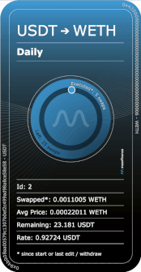

# NFT/Permissions

## NFT

Mean Finance positions are actually NFTs (ERC721), which means positions can be transferred, as well as bought/sold.


With Mean Finance positions, whoever owns the corresponding NFT has full control over position, so please be careful about selling or transferring your NFT!


### Representation

Now, your NFT provides not only ownership, but it also displays information about your position. The NFT's image will showcase the current status of your position like, amount of swaps executed, amount of swaps left, average price, and more!&#x20;


Your NFT's image is generated automatically on-chain, so you don't have to worry about external servers or anything like that. It will always be displayed whenever you want to check it.


## Additional Permissions

As we just explained, your NFT gives you full control over your position but, what if you wanted to grant other users or protocols access to your position too? To enable this use case, we've added a new permission system, where you can give addresses specific permissions to your position.

| Permission        | Description                                                                                         |
| ----------------- | --------------------------------------------------------------------------------------------------- |
| Increase Position | This permission would allow a specific address to add more funds to your position.                  |
| Reduce Position   | This permission would allow a specific address to withdraw un-swapped funds from your position.     |
| Withdraw Swapped  | This permission would allow a specific address to withdraw funds from your swapped balance.         |
| Terminate         | This permission would allow a specific address to withdraw all balance and terminate your position. |

### Note on transfers

The owner of the position can assign as many permissions as they want to their position, there is no limitation. However, since positions are NFTs, they can be sold/transferred. When a position is transferred, then all additional permissions that had been given are automatically revoked.&#x20;

This is mainly for security reasons, so that the new owner doesn't end up with unknown addresses with access to their position. However, it could happen that a user just wants to transfer their position between wallets. In that case, they will have to re-assign all permissions again.
